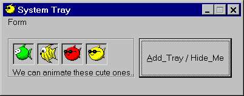



## SystemTrayIcon\!\!\!  \[Easiest access to you SystemTray\]

### Description

Upgrade on a request from PSC. Optimized version for creating animated tray icon. You can ADD... DELETE... MODIFY... tray ICON with TOOLTIP. Simple module with minimal code... Highly recomented, error free code. Feel free to ask me, if you have anu questions... Jim Jose ;-))
 
### More Info
 

             |
---                |---
**Submitted On**   |2005-07-06 17:00:18
**By**             |[JJJJJJJJ](https://github.com/Planet-Source-Code/PSCIndex/blob/master/ByAuthor/jjjjjjjj.md)
**Level**          |Intermediate
**User Rating**    |4.9 (44 globes from 9 users)
**Compatibility**  |VB 6\.0
**Category**       |[Custom Controls/ Forms/  Menus](https://github.com/Planet-Source-Code/PSCIndex/blob/master/ByCategory/custom-controls-forms-menus__1-4.md)
**World**          |[Visual Basic](https://github.com/Planet-Source-Code/PSCIndex/blob/master/ByWorld/visual-basic.md)
**Archive File**   |[SystemTray1912397122005\.zip](https://github.com/Planet-Source-Code/jjjjjjjj-systemtrayicon-easiest-access-to-you-systemtray__1-61660/archive/master.zip)

